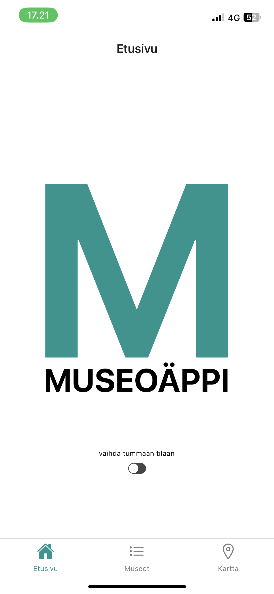
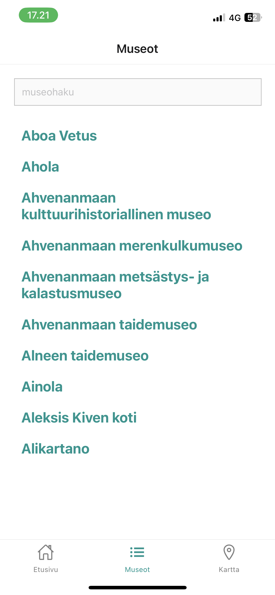
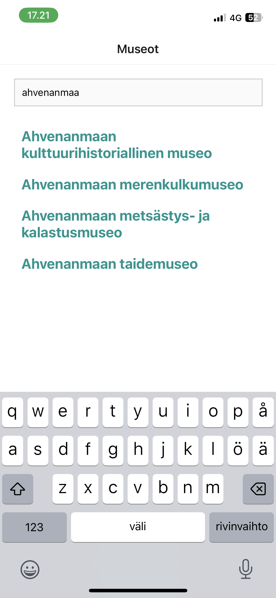
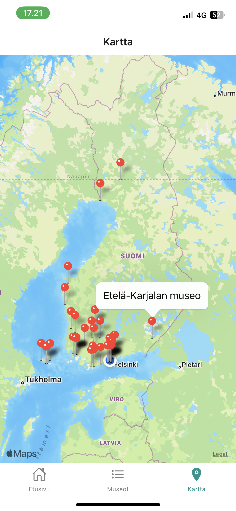

<!-- PROJECT LOGO -->
<br>
<div align="center">
  <h1 align="center">Museosovellus</h1>
  <h3 align="center">Projekti luotu Ohjelmistoprojekti II kurssilla</h3><br>
</div>

### Käytetyt teknologiat ja muut resurssit

- [React Native](https://reactnative.dev)
- [Expo](https://expo.dev)
- [Museotilasto](https://www.museotilasto.fi) ```Sh Museotilaston vuosittainen data vuodesta 2007 lähtien on lisensoitu Creative Commons Nimeä 4.0 (CC BY 4.0) lisenssillä. Tilastotiedon uudelleenkäytön yhteydessä tulee mainita Museovirasto tiedon tuottajana ja Museotilasto tiedon lähteenä. Lisenssiin voi tutustua tarkemmin verkossa osoitteessa https://creativecommons.org/licenses/by/4.0/deed.fi.

Lisensointi koskee Excel- ja CSV-muodossa koostettuja vuosittaisia taulukoita sekä kaikkea tilastohaun kautta haettua tietoa. Valittu lisenssi tarkoittaa, että tilastotiedot ovat vapaasti käytettävissä, kunhan alkuperäislähteeseen viitataan. Lisensointi ei toistaiseksi koske tilastojulkaisuja, joiden osalta käyttöoikeuksia ei ole erikseen määritelty.```

### Asennus

1. Kloonaa repository
  ```sh
  git clone https://github.com/Museosovellus/MuseoFrontend.git
  ```

2. Asenna tarvittavat paketit
  ```sh
  npm install
  ```

3. Sovelluksen käynnistys
  ```sh
  npx expo start
  ```
4. Skannaa terminaaliin tuleva QR-koodi kamerasovelluksella (iOS) tai Expo-sovelluksella (Android)

### Käyttöliittymä

<figure>
  
  <figcaption>Sovelluksen etusivu</figcaption><br>

  
  <figcaption>Museoiden listanäkymä</figcaption><br>

  
  <figcaption>Museoiden listanäkymä rajattuna hakusanalla</figcaption><br>

  
  <figcaption>Museoiden karttanäkymä</figcaption>
</figure>
